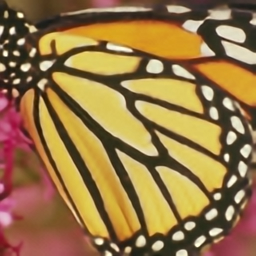

# PyTorch VDSR
Implementation of CVPR2016 Paper: "Accurate Image Super-Resolution Using 
Very Deep Convolutional Networks"(http://cv.snu.ac.kr/research/VDSR/) in PyTorch

## Usage
### Training
```
usage: main.py [-h] [--batchSize BATCHSIZE] [--nEpochs NEPOCHS] [--lr LR]
               [--step STEP] [--cuda] [--resume RESUME]
               [--start-epoch START_EPOCH] [--clip CLIP] [--threads THREADS]
               [--momentum MOMENTUM] [--weight-decay WEIGHT_DECAY]
               
optional arguments:
  -h, --help            Show this help message and exit
  --batchSize           Training batch size
  --nEpochs             Number of epochs to train for
  --lr                  Learning rate. Default=0.01
  --step                Learning rate decay, Default: n=10 epochs
  --cuda                Use cuda
  --resume              Path to checkpoint
  --clip                Clipping Gradients. Default=0.4
  --threads             Number of threads for data loader to use Default=4
  --momentum            Momentum, Default: 0.9
  --weight-decay        Weight decay, Default: 1e-4
```

### Test
```
usage: test.py [-h] [--cuda] [--model MODEL] [--image IMAGE] [--scale SCALE]
               
optional arguments:
  -h, --help            Show this help message and exit
  --cuda                Use cuda
  --model               Model path. Default=model/model_epoch_50.pth
  --image               Image name. Default=butterfly_GT
  --scale               Scale factor, Default: 4
```
We use PIL for image convertion, for best PSNR performance, please use Matlab

### Prepare Training dataset
  - We provide a simple hdf5 format training sample in data folder with 'data' and 'label' keys, the training data is generated with Matlab Bicubic Interplotation, please refer [Code for Data Generation](https://github.com/twtygqyy/pytorch-vdsr/tree/master/data) for creating training files.
  - Drag and drop images (requires your Dropbox account be linked)

### Performance
  - We provide a pretrained VDSR model trained on [291](http://cv.snu.ac.kr/research/VDSR/train_data.zip) images with data augmentation
  - No bias is used in this implementation, and the gradient clipping's implementation is different from paper
  - Performance in PSNR on Set5
  
| Scale        | VDSR Paper          | VDSR PyTorch|
| ------------- |:-------------:| -----:|
| 2x      | 37.53      | 37.65 |
| 3x      | 33.66      | 33.77|
| 4x      | 31.35      | 31.45 |

### Result
From left to right are ground truth, bicubic and vdsr
<p>
  
  
  
</p>